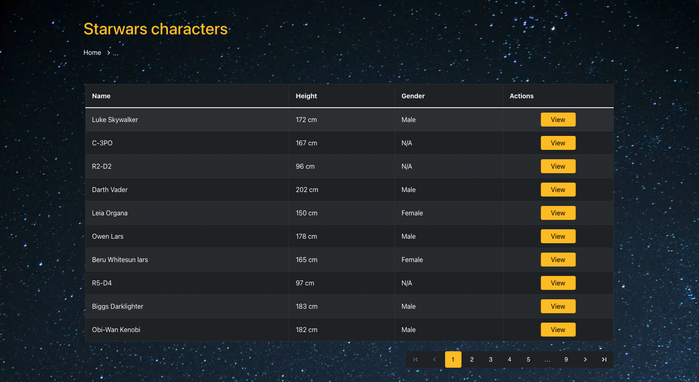
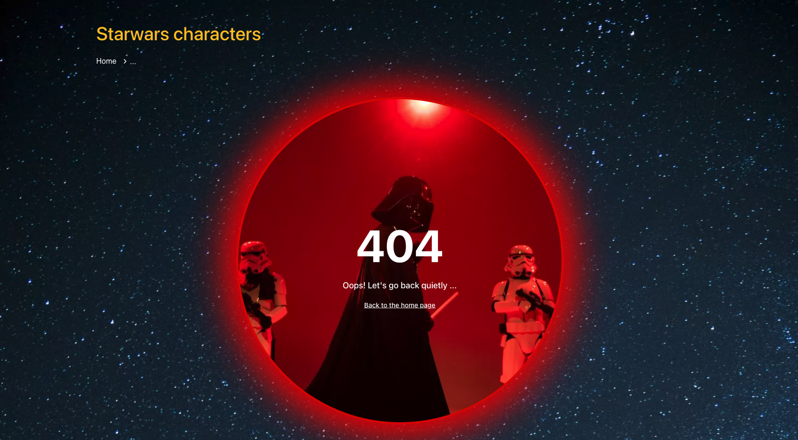

# Project with Starwars API , React, Redux, Bootstrap & MUI

This project was bootstrapped with [Create React App](https://github.com/facebook/create-react-app).

-   [Starwars API](https://swapi.dev)
-   [See my Website](https://stellular-bublanina-375797.netlify.app/) 👋

<kbd></kbd>

## 1. Dependencies

-   [react](https://reactjs.org/) v18.1.0
-   [react-router-dom](https://reactrouter.com/web/guides/quick-start) v6.3.0
-   [prop-types](https://yarnpkg.com/package/prop-types) v15.8.1
-   [axios](https://axios-http.com/docs/intro) v0.27.2
-   [Redux](https://redux.js.org/) v4.2.0
-   [react-redux](https://react-redux.js.org/) v8.0.1
-   [redux-thunk](https://github.com/reduxjs/redux-thunk) v2.4.1
-   [bootstrap](https://yarnpkg.com/package/bootstrap) v5.1.3
-   [react-bootstrap](https://react-bootstrap.github.io/getting-started/introduction/) v2.3.1
-   [material-ui](https://mui.com/material-ui/getting-started/installation/) v5.6.4

## Available Scripts

In the project directory, you can run:

### `npm start`

Runs the app in the development mode.
Open [http://localhost:3000](http://localhost:3000) to view it in your browser.

## 🚨 Be careful 🚨

If you get lost and get to the page 404, Enemies could be hiding there ... 😱

<kbd></kbd>
