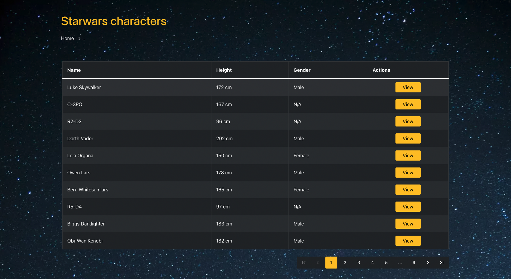
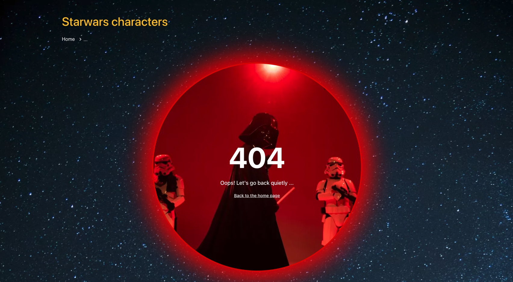

# Project with Starwars API , React, Redux, Bootstrap & MUI

This project was bootstrapped with [Vite](https://vite.dev/).

-   [Starwars API swapi.info](https://swapi.info/api/)
-   [See my Website](https://stellular-bublanina-375797.netlify.app/) 👋

<kbd></kbd>

## 1. Dependencies

-   [react](https://reactjs.org/) v18.3.1
-   [react-router-dom](https://reactrouter.com/web/guides/quick-start) v6.3.0
-   [prop-types](https://yarnpkg.com/package/prop-types) v15.8.1
-   [Redux-Toolkit + Redux-Toolkit Query](https://redux-toolkit.js.org/) v2.8.2
-   [react-redux](https://react-redux.js.org/) v9.2.0
-   [material-ui](https://mui.com/material-ui/getting-started/installation/) v7.2.0

## Available Scripts

In the project directory, you can run:

### `yarn start`

Runs the app in the development mode.
Open [http://localhost:3000](http://localhost:3000) to view it in your browser.

## 🚨 Be careful 🚨

If you get lost and get to the page 404, Enemies could be hiding there ... 😱

<kbd></kbd>
